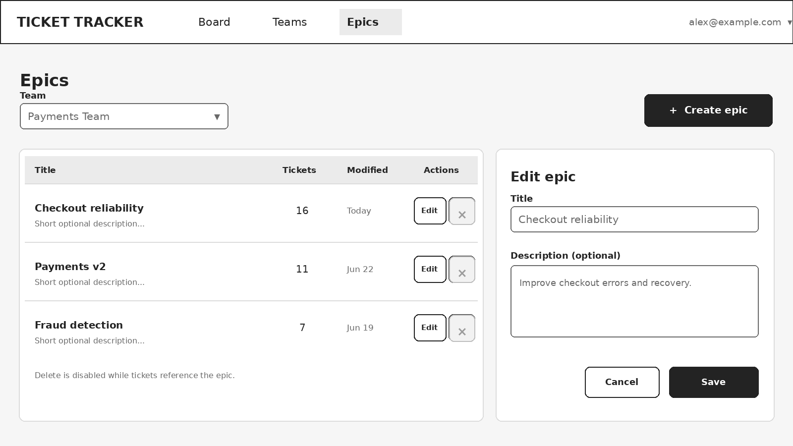

# Hackathon Task: Ticketing System — Participant Requirements Specification

> Source of truth for this project. Section numbers (§1–§15) match the original
> requirements document v3.1; cite them in commits, plans, and PRs.
> Build a small, working Kanban-style ticket tracker as a three-tier SPA backed by an RDBMS.

**Mandatory scope:** authentication, teams, epics, tickets, comments, and a draggable Kanban board.
**Out of scope:** Scrum, sprints, SSO, and advanced project-management features (see §12).

---

## 1. Objective

Create a complete web application that allows registered users to organize work tickets by team and move them through a fixed Kanban workflow. The solution must demonstrate a functional user interface, server-side business logic, and persistent relational storage.

## 2. Required Architecture

- Single-page application (SPA) frontend.
- Backend application exposing an HTTP API.
- Relational database management system (RDBMS) for all persistent application data.
- Clear separation between presentation, application/API, and persistence tiers.
- The frontend and backend may be deployed as separate containers, or the backend may serve the compiled SPA, provided the three logical tiers remain clearly separated.
- Use a dedicated server-based RDBMS container such as PostgreSQL.
- Programming languages and frameworks are unrestricted. The application must be cross-platform.
- From a clean checkout, the complete solution must start from the repository root with `docker compose up --build`; no host-installed frontend, backend, or database runtime may be required beyond Docker Compose. The QA team must be able to run the application on a clean Windows, macOS, or Linux laptop.

## 3. User Accounts and Authentication

- Users can sign up using an email address and password. Email addresses are trimmed, compared case-insensitively, and must be unique.
- Users can log in and log out using local credentials. SSO and external identity providers are not required.
- Passwords must contain at least 8 characters, must never be stored in plain text, and must be hashed using an established password-hashing algorithm such as Argon2id.
- After sign-up, the system sends an email-verification message through a configurable SMTP service. The implementation must support `relay1.dataart.com`.
- A newly registered account cannot use the main application until the email address is verified.
- Verification links or tokens expire after 24 hours and are single-use. A successful verification leads the user to the login screen; automatic login is not required.
- An unverified user can request a new verification email from the login or verification-result screen. Issuing a new token invalidates earlier unused tokens.
- All business application screens and API endpoints require authentication, except sign-up, login, email verification, and verification-email resend. Static frontend assets and optional health/readiness endpoints may remain public.

## 4. Teams

- Tickets are grouped by team.
- Authenticated users can view the list of teams and create, rename, and delete teams.
- A team has at least: identifier, name, created timestamp, and modified timestamp.
- Team names must be non-empty after trimming and unique case-insensitively.
- A team cannot be deleted while it contains tickets or epics. The UI must show a clear validation message; cascading deletion of a team is not allowed.
- Team ownership and membership are not part of the mandatory scope. All verified users can view and manage all teams.

## 5. Epics

- Each epic belongs to exactly one team.
- The team is selected when the epic is created and cannot be changed later. Moving an epic between teams is out of scope.
- Provide a separate screen for epic CRUD operations: create, list, edit, and delete.
- An epic has at least: identifier, team reference, title, optional description, created timestamp, and modified timestamp.
- Epic titles must be non-empty after trimming.
- A ticket may optionally reference one epic, selected from a drop-down list.
- A ticket may reference only an epic that belongs to the same team as the ticket; the backend must enforce this relationship.
- An epic cannot be deleted while tickets reference it. The UI must show a clear validation message.

## 6. Tickets

Each ticket must contain the following fields:

| Field | Required | Allowed values / type | Notes |
|---|---|---|---|
| ID | Yes | System-generated identifier | Stable and unique. |
| Team | Yes | Reference to a team | Determines the team board. Must reference an existing team. |
| Type | Yes | `bug` \| `feature` \| `fix` | Use exactly these three values. Classification labels only; no different workflow behavior per type. |
| State | Yes | `new` \| `ready_for_implementation` \| `in_progress` \| `ready_for_acceptance` \| `done` | Canonical API values. The UI should display human-readable labels with spaces. The workflow is fixed; no custom states. |
| Epic | No | Reference to an epic | Selected from the epic list for the ticket's team. Must be null or reference an epic from that same team. |
| Title | Yes | Text | Non-empty after trimming. Short display text; no mandatory max length. |
| Body | Yes | Long text | Non-empty. Plain text or Markdown acceptable; rich-text editing not required. No mandatory max length. |
| Created at | Yes | Timestamp | Set by the server in UTC when the ticket is created. |
| Modified at | Yes | Timestamp | Set by the server in UTC whenever ticket fields or state change. Adding a comment does not change it. |
| Created by | Yes | Reference to user | Set automatically from the authenticated user. |

**Ticket operations:**

- Create a ticket.
- Open and view all ticket fields, including created by, created at, and modified at.
- Edit ticket type, team, epic, title, body, and state.
- The modified timestamp represents the latest actual ticket field or state change. Saving unchanged values must not advance it.
- When a ticket's team changes, the UI must clear or replace any selected epic. The backend must reject a ticket whose epic belongs to a different team.
- Delete a ticket after an explicit confirmation. Deleting a ticket also deletes its comments.
- State changes performed by drag-and-drop must be persisted immediately in the database.
- The backend must validate all submitted enum values and references; client-side validation alone is insufficient.

## 7. Comments

- Authenticated users can add comments to a ticket.
- A comment contains: identifier, ticket reference, author, body, and created timestamp.
- Comment bodies must be non-empty.
- Comments are displayed chronologically, oldest first.
- Adding a comment does not update the ticket modified timestamp and therefore does not change the ticket's board ordering.
- Comments are immutable after creation for the mandatory scope. Editing and deleting comments may be implemented as stretch features.

## 8. Kanban Board

- The primary screen is a Kanban board for one selected team.
- The board contains exactly five columns, one for each ticket state, in workflow order.
- Each ticket is displayed as a card showing at least its title and type. Showing its epic is recommended.
- Users can drag a ticket card from one column to another. Dropping a card changes its state and persists the change through the backend API.
- If a drag-and-drop update fails, the card must return to its previous column and the UI must display an error.
- Cards may be moved directly between any two states; enforcing sequential transitions is not required.
- Within a column, cards are ordered by most recently modified first. Persisting a custom manual order is not required.
- The board must provide a clear way to create a ticket and open an existing ticket.
- At minimum, provide filtering by ticket type and epic, plus a case-insensitive substring search over ticket title. Active filters are combined using AND logic and may be implemented client-side or server-side.
- The interface must remain usable with at least 100 tickets on one team board.

## 9. API and Persistence Expectations

- All create, update, and delete operations must be performed through the backend API and persisted in the RDBMS.
- The application must not rely on browser local storage as the system of record.
- Use database constraints and/or server-side validation to maintain referential integrity.
- Return meaningful HTTP status codes and error messages for validation failures, authentication failures, missing records, and conflicts. Attempts to delete a team that contains tickets or epics, or an epic referenced by tickets, should return **HTTP 409 Conflict**.
- Identifiers may be UUIDs or database-generated numeric values. API timestamps must use an ISO-8601 representation in UTC.
- Cookie-based sessions or bearer-token authentication are both acceptable. Session identifiers, access tokens, and bearer tokens must not be placed in URLs. A single-use email-verification token may be included in the verification URL.
- Concurrent-edit conflict detection is not required; last successful write wins.
- Database schema creation must be automated through migrations or an equivalent repeatable initialization mechanism.
- After migrations or initialization complete, a fresh database must contain no application users, teams, epics, tickets, or comments. Migration metadata is allowed. The default startup path must not load sample or seed data; QA will create test data through the application UI or API.

## 10. Minimum Screens

- Sign-up screen.
- Email verification result screen.
- Verification-email resend action for unverified or expired-token cases.
- Login screen.
- Kanban board with team selector.
- Ticket create/edit/details view.
- Team management screen.
- Epic management screen.

## 11. Non-Functional Requirements

- **Security:** protect authenticated endpoints, hash passwords, validate input, and avoid exposing credentials or SMTP secrets in source control.
- **Reliability:** a browser refresh or application restart must not lose persisted data.
- **Usability:** display loading, empty, success, and error states where applicable.
- **Compatibility:** support a current desktop version of Chrome, Edge, or Firefox.
- **Maintainability:** include a README with prerequisites, configuration, startup commands.
- **Testing:** include automated tests covering at least one backend business flow and at least one frontend or API flow.

## 12. Explicitly Out of Scope

- Scrum functionality, sprints, backlogs, story points, velocity, burndown charts, or sprint planning.
- SSO, OAuth login, corporate identity integration, or social login.
- Fine-grained roles, administrators, team membership, private teams, or per-ticket access control.
- File attachments, notifications, mentions, watchers, audit history, and real-time multi-user updates.
- Custom workflows, custom ticket types, subtasks, dependencies, time tracking, and reporting dashboards.
- Production deployment, high availability, and production-grade mail infrastructure.

## 13. Definition of Done

- ☐ A user can sign up, receive a verification email through the configured SMTP service, verify the account, and log in.
- ☐ Teams and epics can be managed through the UI and persist in the database.
- ☐ A verified user can create, view, edit, and delete tickets.
- ☐ A user can add comments and see their author and timestamp.
- ☐ The Kanban board shows tickets in the correct state columns for the selected team.
- ☐ Dragging a ticket to another column updates the server and remains correct after refreshing the page.
- ☐ The application can be started from a clean checkout with `docker compose up --build` from the repository root.
- ☐ The solution contains no hard-coded user password or committed secret.
- ☐ A fresh database starts with schema and migration metadata only; no application data is preloaded.
- ☐ QA can create all required test or demo data through the application UI or API without manually changing database records.

## 14. Optional Stretch Features

- Password reset flow.
- Edit or delete own comments.
- Ticket activity history.
- Virtualized rendering for large boards.

## 15. Reference Wireframes

These low-fidelity wireframes illustrate the expected information hierarchy and primary user flows. **They are not a required visual design:** participants may use a different layout as long as all mandatory actions and states remain clear and usable. The collapsed user menu shown in the header is expected to include **Log out**. Disabled delete controls indicate records that cannot currently be deleted because they are referenced.

> **How to read the transcriptions below.** Bullets marked **[hierarchy]** describe layout/structure that is *reference only* per §15 — match the information hierarchy, not the pixels. Bullets marked **⚠ [implied]** are concrete behaviors or data the wireframes show that the prose sections (§3–§10) do not state explicitly — treat these as requirements to verify, since they are easy to miss in testing.

### Wireframe 1 — Kanban board (primary screen)

- **[hierarchy]** Top nav bar: app title ("TICKET TRACKER"), primary tabs **Board / Teams / Epics**, and the signed-in user's email at top-right with a dropdown affordance (▾).
- **[hierarchy]** Below nav: a **Team** selector (dropdown) on the left and a prominent **+ New ticket** button on the right.
- **[hierarchy]** Filter bar: **Search** (title substring), **Type** filter ("All types"), **Epic** filter ("All epics"), a **Clear** button, and a ticket-count readout on the right.
- **[hierarchy]** Exactly **5 columns** in workflow order: NEW, READY FOR IMPLEMENTATION, IN PROGRESS, READY FOR ACCEPTANCE, DONE — displayed as human-readable labels (§6 maps these to canonical enum values).
- **[hierarchy]** Card contents: type badge (BUG / FEATURE / FIX), title, "Epic: `<name>`", and a relative timestamp.
- **⚠ [implied]** Each **column header shows a count** of tickets in that column (e.g. NEW = 8, DONE = 14).
- **⚠ [implied]** The filter bar shows a **total ticket count** for the selected team ("42 tickets").
- **⚠ [implied]** Card timestamps are rendered **relative** ("2h ago", "1d ago"), not as absolute dates. (Contrast with the ticket detail screen, which shows absolute UTC.)
- **⚠ [implied]** The **user menu (email ▾) is where Log out lives** — confirmed by §15 preamble.

### Wireframe 2 — Login, sign-up, and email verification

- **[hierarchy]** Three related states shown side by side: **Log in**, **Create account**, **Email verification** result.
- **[hierarchy] Log in:** Email field, Password field, **Log in** button, and a link to **Create an account**.
- **[hierarchy] Create account:** Email, Password, **Confirm password**, **Sign up** button, and an "Already registered? Log in" link. Password field hints "Minimum 8 characters" (§3).
- **[hierarchy] Email verification (success):** confirmation icon, "Email verified" message, and a **Continue to login** button (no auto-login — §3).
- **⚠ [implied]** The login screen shows an **"Account not verified?" prompt with a Resend email button** — i.e. resend is reachable directly from the login screen for unverified accounts (§3 requires resend from login *or* verification-result screen; the wireframe puts it on both).
- **⚠ [implied]** Sign-up includes a **confirm-password** field — a client-side check not named in §3's prose.
- **⚠ [implied]** The verification-result screen must handle the **expired/invalid link** case: "Show an error and a resend action." So the same screen has two variants (verified vs expired) and the expired variant offers resend.

### Wireframe 3 — Ticket details, editing, and comments

- **[hierarchy]** Header row: a **"← Back to `<Team>`"** link; a metadata line showing ticket ID, "Created by `<user>`", "Created `<ts>` UTC", "Modified `<ts>` UTC"; the ticket title; and **Delete** + **Save** buttons top-right.
- **[hierarchy]** Left/main pane — editable fields: **Team** (dropdown), **Type** (dropdown), **State** (dropdown), **Epic** (dropdown), **Title** (text), **Body** (multi-line).
- **[hierarchy]** Right pane — **Comments**: a count, a chronological list (oldest first) of comments each showing author + time + body, an **Add comment** textarea, and a **Post comment** button.
- **⚠ [implied]** The detail view renders **absolute UTC timestamps** ("Created Jun 22, 09:15 UTC", "Modified Jun 23, 12:40 UTC") — distinct from the board's relative format.
- **⚠ [implied]** Type and State dropdowns display **human-readable labels** ("Bug", "In progress") while the API uses canonical values (§6).
- **⚠ [implied]** The **Comments panel shows a count** ("3"), and comment timestamps are shown as **time-of-day** ("10:05", "11:20").
- **⚠ [implied]** Delete is an explicit button on the detail screen and requires confirmation (§6) — the wireframe implies a confirm step before deletion.
- **⚠ [implied]** Editing Team here must trigger the §6 rule: **changing Team clears/replaces the selected Epic**, and the Epic dropdown is scoped to the ticket's team.

### Wireframe 4 — Team management

- **[hierarchy]** "Teams" heading with subtitle "All verified users can view and manage all teams" and a **+ Create team** button top-right.
- **[hierarchy]** A table with columns: **Name**, **Tickets**, **Epics**, **Modified**, **Actions** (Edit / Delete per row).
- **[hierarchy]** A **Create team** form with a "Team name" input and **Create** button.
- **⚠ [implied]** The table shows **per-team counts of Tickets and Epics** — data the list endpoint must return, not just team name/timestamps (§4 lists only id/name/timestamps).
- **⚠ [implied]** The **Delete button is disabled (greyed) when a team has tickets or epics** (rows with counts > 0), enabled only at 0/0 — the visual expression of the §4/§9 409 rule. Caption: "Delete is disabled while a team contains tickets or epics."
- **⚠ [implied]** Modified is shown in a **friendly relative form** ("Today 12:40", "Yesterday", "Jun 20").
- **⚠ [implied]** Each team row exposes an **Edit** action (rename — §4).

### Wireframe 5 — Epic management

- **[hierarchy]** "Epics" heading with a **Team** selector beneath it (epics are listed per selected team — §5), and a **+ Create epic** button top-right.
- **[hierarchy]** A table with columns: **Title**, **Tickets**, **Modified**, **Actions** (Edit / Delete per row).
- **[hierarchy]** An **Edit epic** panel with **Title** and **Description (optional)** fields, plus **Cancel** and **Save** buttons.
- **⚠ [implied]** Epics are **filtered by the selected team** — the screen is team-scoped, consistent with "each epic belongs to exactly one team" (§5). The team is chosen at creation and immutable thereafter.
- **⚠ [implied]** The table shows a **per-epic Tickets count** — data the epic list endpoint must return.
- **⚠ [implied]** The **Delete (×) control is disabled when tickets reference the epic**, enabled otherwise. Caption: "Delete is disabled while tickets reference the epic" (the §5/§9 409 rule, expressed visually).
- **⚠ [implied]** The epic list shows a short **description preview** per row ("Short optional description…").
